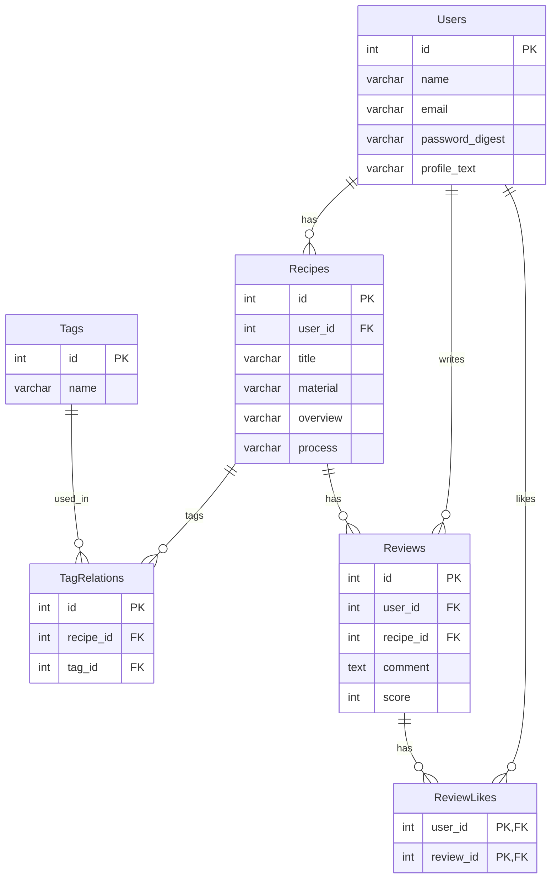

# dirty

# Entity Relationship Diagram

```mermaid
erDiagram
  Users {
    int id PK
    varchar name
    varchar email
    varchar password_digest
    varchar profile_text
  }

  Recipes {
    int id PK
    int user_id FK
    varchar title
    varchar material
    varchar overview
    varchar process
  }

  Tags {
    int id PK
    varchar name
  }

  TagRelations {
    int id PK
    int recipe_id FK
    int tag_id FK
  }

  Reviews {
    int id PK
    int user_id FK
    int recipe_id FK
    text comment
    int score
  }

  ReviewLikes {
    int user_id PK, FK
    int review_id PK, FK
  }

  %% 関連性定義
  Users ||--o{ Recipes : has
  Users ||--o{ Reviews : writes
  Users ||--o{ ReviewLikes : likes

  Recipes ||--o{ Reviews : has
  Recipes ||--o{ TagRelations : tags

  Tags ||--o{ TagRelations : used_in

  Reviews ||--o{ ReviewLikes : has
```
